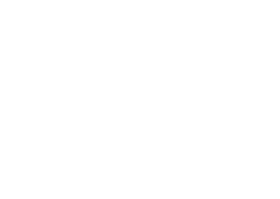
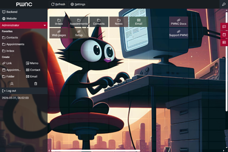
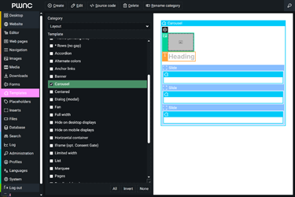
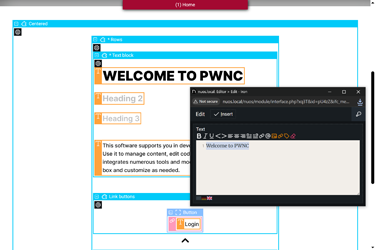

# AI Multi-Agent Platform

PWNC is a lightweight, zero-dependency PHP/MySQL platform for building and running websites and web apps – solo, in a team, with AI.

AI agents can fully operate the platform via controlled and token-efficient HATEOAS. They are first-class users: their own account, granular permissions, and governed-persistent shared memory. No separate API – they use the same UI you do, without having to render it.

**Easily connectable to modern AI agents through a built-in MCP 2026-07-28 server.**

That makes the platform adaptive: agents pick up every extension and every app you build on it the moment it exists. Nothing to teach them, no tool definitions to maintain – they build your websites and web apps, and run them.

**A platform your AI agents can run – on native web standards, at rapid speed, practically everywhere, and any agent.**

&ensp;&ensp;

Easy install: upload it to your webspace, call `/pwnc`, enter **admin** / **admin** and follow the instructions.

---

## Legal Note

PWNC is source-available, ***not*** open source. While you are free to use and modify the software for your projects (private and commercial) and use the "fork" function to make public copies on GitHub, **public forks of modified versions are prohibited** under the [PWNC Web Platform License](LICENSE.md).

---

## Status

- **Production-Ready**
- **Actively Maintained**
- **Integrated Updates**

---

## Features

### AI Agents as First-Class Users

- **Hand Over Real Work:** agents get their own account and drive the whole platform – frontend, backend and desktop – through a built-in MCP server (2026-07-28, Streamable HTTP, JSON-RPC 2.0, OAuth 2.0 and API keys)
- **Safe by Construction:** they use the same UI you do and see only what their role allows – no second API to secure or keep in sync
- **Connected in One Step:** ready-made MCP bundle and automatic client configuration for Claude Desktop, Claude Code and other MCP clients
- **A Workplace That Learns:** a generalized shared memory makes agents more efficient and lets them coordinate
- **Token-Efficient by Default:** agents spend their context on the task instead of re-reading what they already fetched
- **One Agent per Role:** any user account can be run as an agent, with its own standing instruction and API key

### Core Platform & Editing

- **Context-Sensitive WYSIWYG Editor** with multiple editing views: full, layout, content, output
- **Nested Template & Component System** with ready-to-use, extensible components
- **Asset & Data Management** for media, downloads, files, and database tables
- **Form Editor** for creating and managing web forms

### Applications & Tools

- **Frontend:** Blog, Forum, Chat, Comment System, RSS Reader, User Registration/Profile Management, Search Engine, ~150 ready-to-use/customizable components
- **Backend:** Editorial System (role-based responsibilities, personal & shared workspaces, time-based content control, versioning), Solo Webpage Manager, Navigation Manager, Database & File Management, SQL Console, Web Crawler, Logging, Language Configuration, User & Permissions Management, Setup & Updates
- **Web Desktop:** Calendar, Contacts, Notes, Email Client, Instant Messaging, Links

### Performance, Security & Usability

- **SEO & Performance:** XML sitemaps, canonical/alternate links, RSS feeds, responsive image optimization (WebP/JPEG), selective caching, lean JavaScript without third-party frameworks
- **Security & Stability:** Automatic integrity checks, encrypted authentication, login rate limiting, CSRF protection, hashed and rotatable API keys with expiry, bad bot detection, database and full-site ZIP backups, one-click updates, detailed error reporting
- **Usability:** Minimalist, consistent interface optimized for desktop and touchscreen
- **Analytics:** Server-side tracking of page views and user actions, detailed queries, bot filtering, cookie-free and privacy-compliant – no consent banner required
- **Additional:** Multilingual support, background task daemon, multisite-ready, PWA-installable (web app manifest, service worker), agent instructions, skill manuals and API reference included

---

## Technical Requirements

- PHP ≥ 7.4 (PHP 8.x fully supported)
- MySQL ≥ 5.6 or MariaDB ≥ 10.0
- Modern browser (desktop or tablet recommended)
- Storage: ≥ 500 MB (2 GB+ recommended for media-heavy sites)

---

## Installation

1.  **[Download PWNC](https://github.com/heydev-de/pwnc/archive/main.zip)** as a ZIP file and extract it.
2.  Upload the contents of the extracted `pwnc-main` folder into an empty directory on your web server – this becomes your website's root folder (a clear name like `/domain.tld` is recommended).
3.  Adjust `.htaccess` and `robots.txt` to match your server environment and website policy.
4.  Point your domain's **document root** to the installation folder.
5.  Open `domain.tld/pwnc` in your browser and follow the setup instructions. Default login username: **admin**, password: **admin**.

---

## Updates

Update via the built-in system (*Backend → Setup*) to avoid overwriting data. A full backup of installation and database is written to `/#update/backup`, keeping the previous one.

---

## Quick Start

1.  **Backend login:** `domain.tld/pwnc`
2.  **Update page information:** Go to *Placeholders → Category: Info*.
3.  **Replace branding assets:** Go to *Backend → Images* and replace **Logo**, **Logo alternative**, **Icon**, and **Open graph banner** by selecting *Replace image*. Do not delete/reupload.
4.  **Configure languages:** Go to *Backend → Languages*.
5.  **Set canonical URL (multi-domain sites):** Go to *Backend → Navigation*, select the topmost entry, and set the **Canonical base URL** to your preferred main domain.
6.  **Customer account:** A default user named **Customer** (username: **default**) exists under *Backend → Administration*. Unlock it and set a new password before use.
7.  **Publish site:** Unlock the **Guest** (anonymous) account under *Backend → Administration* to make the site publicly accessible.
8.  **Enable the AI agent (optional):** **Agent Mauz** (username: **agentmauz**) ships as a full admin, locked. Unlock it under *Backend → Administration*, set instruction and reminder interval on its **Agent** tab, and issue an API key for your MCP client. Non-admin agents can join the **Agent memory** group for access to the default memory regions.

---

## Resources

- [PWNC Website](https://pwnc.it)
- [Agent Instructions (MCP)](pwnc/mcp/README.md)
- [Template Manual](pwnc/mcp/skills/templates/SKILLS.md)
- [Style Manual](pwnc/mcp/skills/stylesheets/SKILLS.md)
- [API Reference](doc/api/README.md)
- [GitHub Repository](https://github.com/heydev-de/pwnc)

---

## Support

- **Community Support & Feature Requests:** [via forum](https://github.com/heydev-de/pwnc/discussions)
- **Issue Reporting:** [via GitHub](https://github.com/heydev-de/pwnc/issues)
- **Extended Support:** professional services [on request](https://webentwicklung-duesseldorf.com/kontakt.php)

---

## License

PWNC is provided as **proprietary source-available** software. It is free to use for both private and commercial projects, subject to the following conditions:

- **Commercial Use:** Allowed for custom solutions for individual end clients and specific PWNC extensions.
- **Restrictions:** Redistribution of the code (original or modified) and charging fees for the software itself is prohibited.
- **Attribution:** Original copyright notices and visible credit markings in the user interface must be maintained.

Full terms can be found in the [LICENSE.md](LICENSE.md). Governing law is German law (Jurisdiction: Düsseldorf).

---

**Legal Notice:** [pwnc.it/legal-info.php](https://pwnc.it/legal-info.php)