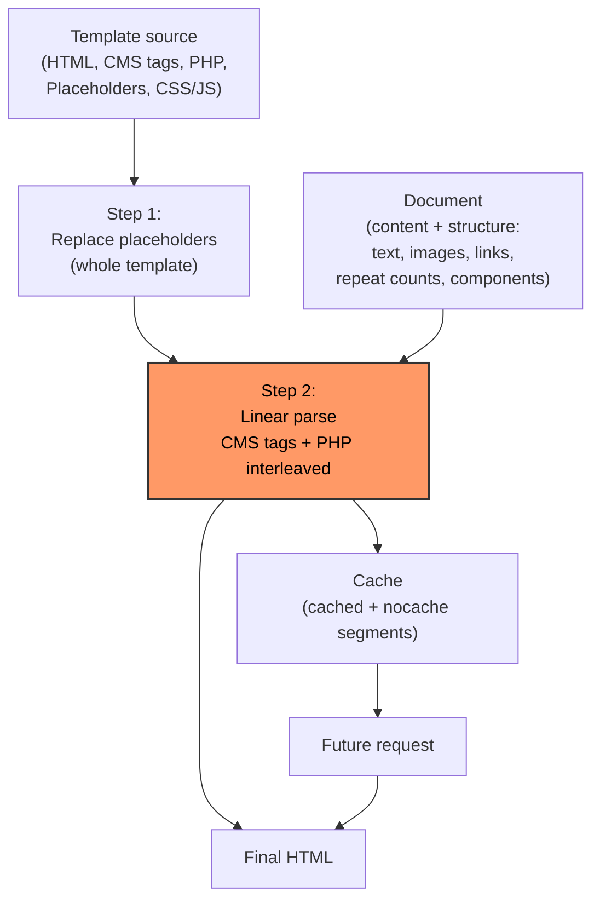
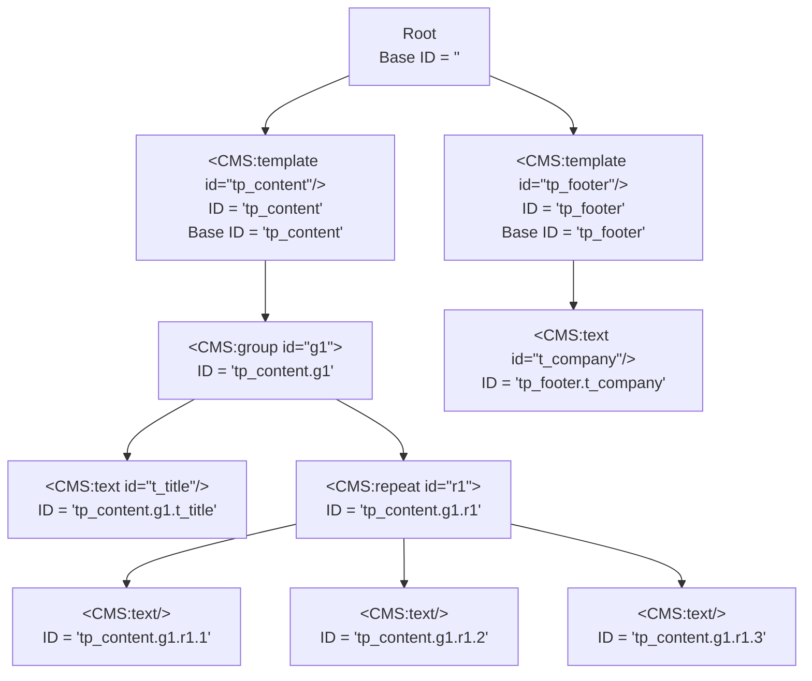

# PWNC Template Manual

## Table of Contents

- [Introduction](#introduction)
- [Quick Start: Your First Component](#quick-start-your-first-component)
- [Mental Model](#mental-model-how-to-think-about-pwnc-templates)
- [Quick Reference](#quick-reference)
  - [All CMS Elements at a Glance](#all-cms-elements-at-a-glance)
  - [ID Syntax Quick Reference](#id-syntax-quick-reference)
  - [When to Use Each Scoping Element](#when-to-use-each-scoping-element)
- [Core Concepts](#core-concepts)
  - [How Templates Work](#how-templates-work)
  - [The ID System](#the-id-system)
  - [Scoping and Nesting](#scoping-and-nesting)
  - [Compatibility Mode](#compatibility-mode)
- [Step-by-Step Guides](#step-by-step-guides)
  - [Create a Page Template](#create-a-page-template)
  - [Create a Reusable Component](#create-a-reusable-component)
  - [Add Editable Settings](#add-editable-settings-to-a-component)
- [Element Reference](#element-reference)
  - [Content Elements](#content-elements)
  - [Navigation Elements](#navigation-elements)
  - [Asset Elements](#asset-elements)
  - [Structural Elements](#structural-elements)
  - [Logic Elements](#logic-elements)
  - [Embed Elements](#embed-elements)
  - [Page-Only Elements](#page-only-elements)
- [Placeholders](#placeholders)
- [PHP Integration](#php-integration)
  - [Basic Usage](#basic-usage)
  - [Available Variables](#available-variables)
  - [Debugging with PHP](#debugging-with-php)
  - [Reading Content Values](#reading-content-values)
  - [Setting Content Values](#setting-content-values)
  - [Image Processing (Advanced)](#image-processing-advanced)
  - [Variable Persistence](#variable-persistence)
- [Patterns & Recipes](#patterns--recipes)
  - [Teaser Card](#teaser-card)
  - [Gallery with Repeat](#gallery-with-repeat)
  - [Conditional Section](#conditional-section)
  - [Settings Panel](#settings-panel)
  - [Nested Repeats](#nested-repeats)
  - [Template Composition](#template-composition)
  - [Edit/View Split](#editview-split)
  - [Caching Dynamic Content](#caching-dynamic-content)
- [Annotated Examples](#annotated-examples)
  - [Example 1: Teaser with Conditional Sections](#example-1-teaser-with-conditional-sections)
  - [Example 2: Image Gallery with Edit/View Split](#example-2-image-gallery-with-editview-split)
  - [Example 3: Module Settings Panel](#example-3-module-settings-panel)
  - [Example 4: Testimonial with Stars and Date Formatting](#example-4-testimonial-with-stars-and-date-formatting)
- [Troubleshooting](#troubleshooting)
  - [IDs Not Working](#ids-not-working)
  - [Conditional Blocks Not Showing](#conditional-blocks-not-showing)
  - [Template Not Found](#template-not-found)
  - [PHP Code Not Executing](#php-code-not-executing)
  - [Edit Mode Issues](#edit-mode-issues)
- [Additional Resources](#additional-resources)

---

## Introduction

PWNC templates are HTML files with custom `<CMS:…>` tags that define editable regions and page structure. The template engine processes these tags and replaces them with content or editing controls.

**Who this manual is for:**
- Developers building templates and components
- Content editors needing to understand template tags
- Coding-trained AI agents generating or modifying PWNC templates

**Where to edit templates:**

In the **PWNC Backend** under **Templates** (`/pwnc` → *Templates*). The editor offers:
- A source code editor (HTML, CSS, PHP, JS, CMS tags, and placeholders)
- Separate stylesheet and JavaScript editors per template
- A prefabs dropdown with all CMS tags for quick insertion
- Template preview
- Template management (name, category, page type)

**Key terms:**

| Term | Meaning |
|------|---------|
| **Page template** | Top-level template that renders a full HTML page |
| **Component** | Reusable template embedded via `<CMS:template/>` |
| **Element** | A single `<CMS:…>` tag — e.g. `<CMS:text/>`, `<CMS:image/>` |
| **ID** | Identifier mapping an element to its stored data in the document |
| **Scope** | Current ID nesting context determining how IDs resolve |
| **Document** | Data object holding all content values for a web endpoint (webpage) instance |
| **Placeholder** | Reusable optionally parameterized code snippet inserted via `%%name param%%` syntax |

---

## Quick Start: Your First Component

A minimal PWNC component is one line:

```html
<CMS:text/>
```

That's a complete component: one editable field for simple formatted text.

Add a second line:

```html
<!-- Editable heading -->
<h1><CMS:text id="title" title="Title"/></h1>

<!-- Editable body -->
<p><CMS:text id="text"/></p>
```

Now there are two editable fields. The `title` attribute labels the field in the editor.

> **Mental model:** Certain `<CMS:…>` tags are slots. The `id` is the address of its content. Everything else is plain HTML. There is always an ID. If you don't specify it, it's a sequential number that's added to a dot-connected nesting path: content.section.1

A realistic component with a link:

```html
<!-- Link wrapper -->
<div class="teaser">

    <!-- Editable heading -->
    <h2><CMS:text id="title" title="Title"/></h2>

    <!-- Editable paragraph -->
    <p><CMS:text id="text"/></p>

    <!-- Link with editable label -->
    <CMS:href id="link" class="button">
        <CMS:text id="link_label" default="Read more"/>
    </CMS:href>

</div>
```

`<CMS:href>` wraps the link label (`<CMS:text/>`). In edit mode, editors set link target and label separately.

---

## Mental Model: How to Think About PWNC Templates

Think of a PWNC template as **HTML with slots**. Each slot is a `<CMS:…>` tag. During rendering:

1. **Placeholders** (`%%name%%`) are replaced first — across the entire template
2. **Static HTML** passes through unchanged
3. **CMS tags** become dynamic content (view mode) or editing controls (edit mode) with simple structural logic (conditional sections and loops)
4. **PHP blocks** run inline for complex logic; can embed complex apps
5. **Each slot has an ID** connecting it to stored content

*Meow* 🐱‍👤



**Remember:** Every editable element has an **ID**. The ID connects content to its slot. Get IDs right, and everything else follows.

---

## Quick Reference

### All CMS Elements at a Glance

| Element | Category | Purpose | Wraps content? |
|-----|----------|---------|----------------|
| `<CMS:text/>` | Content | Editable plain text | No |
| `<CMS:value/>` | Content | Single-line setting value | No |
| `<CMS:href></CMS:href>` | Navigation | Editable hyperlink | Yes |
| `<CMS:menu/>` | Navigation | Navigation menu | No |
| `<CMS:image/>` | Asset | Editable image | No |
| `<CMS:thumbnail/>` | Asset | Image with lightbox zoom | No |
| `<CMS:media/>` | Asset | Video/audio embed | No |
| `<CMS:download></CMS:download>` | Asset | File download link | Yes |
| `<CMS:stylesheet/>` | Asset | Link template CSS | No |
| `<CMS:javascript/>` | Asset | Link template JS | No |
| `<CMS:template/>` | Structure | Embed another template | No |
| `<CMS:group></CMS:group>` | Structure | Group + scope children | Yes |
| `<CMS:repeat></CMS:repeat>` | Structure | Repeat N times | Yes |
| `<CMS:namespace></CMS:namespace>` | Structure | Lightweight ID scope | Yes |
| `<CMS:base></CMS:base>` | Structure | Fully isolated ID namespace | Yes |
| `<CMS:shift></CMS:shift>` | Structure | Reorderable group (legacy) | Yes |
| `<CMS:switch/>` | Logic | Boolean on/off toggle | No |
| `<CMS:cblock></CMS:cblock>` | Logic | Conditional block — shows if element has value | Yes |
| `<CMS:calt></CMS:calt>` | Logic | Conditional alternative — shows if element is empty | Yes |
| `<CMS:edit></CMS:edit>` | Logic | Show only in edit mode | Yes |
| `<CMS:noedit></CMS:noedit>` | Logic | Show only in view mode | Yes |
| `<CMS:nocache></CMS:nocache>` | Logic | Bypass page cache | Yes |
| `<CMS:plugin/>` | Embed | Embed external URL content | No |
| `<CMS:head/>` | Page | Page metadata (`<head>`) | No |
| `<CMS:control/>` | Page | Editing toolbar (`<body>`) | No |
| `<CMS:backlink/>` | Page | PWNC credit link | No |

> **Syntax rules:**
> - Elements that **do not** wrap content *must* use self-closing syntax: `<CMS:text/>`.
> - Elements that **wrap** content *must* have a closing tag: `<CMS:group>…</CMS:group>`.

### ID Syntax Quick Reference

| Syntax | Name | Example | Resolves to |
|--------|------|---------|-------------|
| `id="name"` | Explicit | `id="hero"` | `hero` (fixed) |
| *(omitted)* | Implicit (Auto-ID) | *(no id)* | `1`, `2`, `3`, … |
| `id="+N"` | Relative offset | `id="+1"` | auto-index + 1 |
| `id=".name"` | Relative to base | `id=".title"` | `base_id.title` |
| `id="..name"` | Absolute (root) | `id="..config"` | `config` (from root) |

### When to Use Each Scoping Element

| What you want | Use | Why |
|---------------|-----|-----|
| Build a page from components | `<CMS:template/>` | Embeds another template with its own scope; the primary way to compose pages |
| Group elements | `<CMS:group></CMS:group>` | Enables combined editing functions |
| Fully isolate a component's IDs | `<CMS:base></CMS:base>` | Isolates contained elements (used in export) |
| Light scope without full isolation | `<CMS:namespace></CMS:namespace>` | Like group without editing UI; optionally resets Auto-ID within scope |
| Repeat a section | `<CMS:repeat></CMS:repeat>` | Increments Auto-ID with each loop |
| Shift elements with buttons (legacy) | `<CMS:shift></CMS:shift>` | Superseded by editing UI shift functionality |

---

## Core Concepts

### How Templates Work

PWNC templates are HTML with embedded `<CMS:…>` tags. The engine processes them linearly:

1. **Static HTML** passes through unchanged
2. **CMS tags** become dynamic content (view) or editing controls (edit)
3. **Placeholders** (`%%name param%%`) are replaced with stored code
4. **PHP blocks** execute inline
5. The engine tracks **element IDs** to map content to database records
6. **Nested scopes** (template, group, base, namespace, repeat) control ID resolution

**Two rendering modes:**

| Mode | What CMS elements do |
|------|------------------|
| **View** (default) | Output stored content (or nothing if empty) |
| **Edit** | Output editing controls (buttons, drag handles, placeholders) |

PWNC has a live frontend that decides by permission what the user can do. Editing and production stack are identical. You decide, which parts will be cached and which stay dynamic. This allows you to optimize performance vs flexibility ratio.

The PWNC page editor offers **4 aggregate editing modes** — selections of which element types are editable:

| Mode | Included types |
|------|----------------|
| **Full** | All |
| **Layout** | `value`, `template`, `group`, `repeat`, `shift`, `cblock`, `switch` |
| **Content** | `href`, `plugin`, `text`, `download`, `image`, `thumbnail`, `media`, `cblock` |
| **Output** | None (pure view) |

You can also toggle individual element type editing on/off via the control panel.

**How `<CMS:edit>` and `<CMS:noedit>` respond:** `<CMS:edit>` appears when at least one listed element type is editable; `<CMS:noedit>` appears when none are. See [Tag Reference: Logic Elements](#logic-elements) for full rules and examples.

> **Permissions:** Available editing controls depend on user permissions. Without access to the image database, `<CMS:image/>` does nothing. Without template module access, layout editing is unavailable.

### The ID System

> **IMPORTANT:** IDs are the core of PWNC templates.

Every editable element can have an `id` attribute — the address where content is stored and retrieved. Without an `id`, the engine auto-assigns a consecutive number.

#### ID Types

| Type | Syntax | Use |
|------|--------|-----|
| **Explicit** (recommended) | `id="header"` | Stable, predictable identifiers |
| **Implicit (Auto-ID)** | *(omit `id`)* | Inside repeats or simple layouts |
| **Relative offset** | `id="+1"` | Offset from current auto-index |
| **Relative named** | `id=".name"` | Relative to current base scope (prefixed with base ID) |
| **Absolute** | `id="..name"` | Relative to root scope (ignores current base) |

**Nesting templates:** `<CMS:template/>` creates a new ID scope for everything inside it. This is how pages are built from components, and how components nest.

**Examples:**

```html
<!-- Explicit: ID = "hero_title" -->
<h1><CMS:text id="hero_title"/></h1>

<!-- Implicit: engine assigns 1, 2, 3, … -->
<h2><CMS:text/></h2>
<p><CMS:text/></p>
<CMS:href/>Click here</CMS:href>

<!-- Relative to base: if base = "g1.", ID = "g1.title" -->
<CMS:text id=".title"/>

<!-- Absolute (global): ID = "config", ignores current scope -->
<CMS:value id="..config"/>
```

#### How IDs Work Inside `<CMS:repeat>`

Inside a `<CMS:repeat>`, **only auto-generated IDs are enumerated**. Explicit IDs remain stable.

```html
<CMS:repeat id="r1" default="3">

    <!-- Explicit: stays "r1.i1" -->
    <CMS:image id="i1"/>

    <!-- Auto-ID: "r1.1", "r1.2", "r1.3" -->
    <CMS:text/>

</CMS:repeat>
```

**Resulting IDs:**

| Iteration | `<CMS:image id="i1"/>` | `<CMS:text/>` (auto) |
|-----------|------------------------|----------------------|
| 1 | `r1.i1` | `r1.1` |
| 2 | `r1.i1` | `r1.2` |
| 3 | `r1.i1` | `r1.3` |

> **Key insight:** Use explicit IDs for content shared across iterations. Use Auto-ID for iteration-specific content.

**A simple example — group within repeat:**

```html
<CMS:repeat id="r1" default="3">

    <!-- Group receives Auto-ID -->
    <CMS:group edit="off">

        <!-- r1.1.title, r1.2.title, … -->
        <h2><CMS:text id=".title"/></h2>

         <!-- r1.1.text, r1.2.text, … -->
        <p><CMS:text id=".text"/></p>

    </CMS:group>

</CMS:repeat>
```

The `<CMS:group>` receives an Auto-ID (`1`, `2`, `3`), and children use relative IDs (`.title`, `.text`) to become `r1.1.title`, `r1.2.title`, etc. Each iteration gets unique content with clean structure.

**Combining explicit and Auto-ID with `<CMS:namespace>` — stable tables:**

This pattern keeps table columns stable when adding or removing rows/columns. `<CMS:namespace auto-id="contain">` contains the Auto-ID counter within its scope, giving each cell a stable position-based ID.

```html
<!-- Controls -->
<CMS:noedit>
<CMS:repeat id=".r1" title="Columns"></CMS:repeat>
<CMS:repeat id=".r2" title="Rows"></CMS:repeat>
</CMS:noedit>

<!-- Variable size HTML table -->
<table>

    <tr>
        <CMS:namespace auto-id="contain">
        <CMS:repeat id=".r1" edit="off">

            <th><CMS:text title="Heading"/></th>

        </CMS:repeat>
        </CMS:namespace>
    </tr>

    <CMS:repeat id=".r2" edit="off">
        <CMS:group edit="off">
            <tr>
                <CMS:namespace auto-id="contain">
                <CMS:repeat id=".r1" edit="off">

                    <td><CMS:text title="Content"/></td>

                </CMS:repeat>
                </CMS:namespace>
            </tr>
        </CMS:group>
    </CMS:repeat>
</table>
```

**ID iteration overview:**

| Row \ Col | 1st column | 2nd column | 3rd column |
|-----------|------------|------------|------------|
| **Header** | `r1.1` | `r1.2` | `r1.3` |
| **Row 1** | `r2.1.r1.1` | `r2.1.r1.2` | `r2.1.r1.3` |
| **Row 2** | `r2.2.r1.1` | `r2.2.r1.2` | `r2.2.r1.3` |
| **Row 3** | `r2.3.r1.1` | `r2.3.r1.2` | `r2.3.r1.3` |

#### Naming Conventions

Common prefixes (not required, but recommended):

| Prefix | Element | Example |
|--------|---------|---------|
| `g_` | group | `g_header`, `g_footer` |
| `h_` | href | `h_link`, `h_cta` |
| `i_` | image | `i_hero`, `i_logo` |
| `i_` | thumbnail | `i_photo`, `i_scetch` |
| `r_` | repeat | `r_items`, `r_gallery` |
| `t_` | text | `t_title`, `t_body` |
| `tp_` | template | `tp_content`, `tp_sidebar` |
| `v_` | value | `v_max_items`, `v_count` |
| `v_` | switch | `v_show`, `v_active` |

For generic fixed IDs, the convention is prefix + number: `t1`, `t2`, `t3`, `i1`, `i2`, `i3`, etc.

#### Exchangeable Components

Using consistent IDs across components makes them **exchangeable** — content stays in context when swapping templates. For example, if all teaser components use `id="t_title"` for the title and `id="h_link"` for the link, you can swap teasers without losing content. The document data maps to the same IDs regardless of the template.

> **Hint:** You can also use placeholders to define IDs. This allows you to keep IDs consistent across components without hard-coding them in every template while managing them centrally.

#### Accessing Content in PHP

Use the document API in embedded PHP:

```php
// Get a specific element's value
$title = $cms_template_document->get($cms_template_base_id . "title", "text");

// Get a repeated element's value (first iteration)
$image = $cms_template_document->get($cms_template_base_id . "r1.1.i1", "image");

// Get without specifying type
$value = $cms_template_document->get($cms_template_base_id . "some_id");
```

> **Key:** `$cms_template_document` is a predefined variable referring the current document object. `$cms_template_base_id` is an automatic variable containing the current component's base path. You can use it to access data within that path. But you can access **any** ID in the document if you know it — for example, use `id="..name"` in templates and access it with `$cms_template_document->get("name", "type")` in PHP.

> **Hint:** Components can share data like that. Use a placeholder to define shared IDs.

**Internal storage types for document access:**

- `text` for `<CMS:text/>`
- `value` for `<CMS:value/>` **and `<CMS:switch/>`** (switches are stored as value internally)
- `image` for `<CMS:image/>` **and `<CMS:thumbnail/>`** (thumbnails are stored as image internally)
- `href` for `<CMS:href></CMS:href>`
- `download` for `<CMS:download></CMS:download>`

```php
// Switch (internally stored as "value")
$show_sidebar = $cms_template_document->get($cms_template_base_id . "show_sidebar", "value");

// Thumbnail (internally stored as "image")
$gallery_image = $cms_template_document->get($cms_template_base_id . "gallery_thumb", "image");
$image_path = translate_url($gallery_image);
```

### Scoping and Nesting

PWNC templates organize content through four interrelated concepts:

- **Base ID** — A root ID for an isolated scope. `<CMS:template/>` and `<CMS:base>` establish a new base ID. Everything inside that scope is prefixed with it.
- **Path** — The nesting chain of elements, forming the direct access ID for content. Each wrapping element adds a dot-delimited segment to the path. A path can also be manipulated — it does not have to reflect the literal nesting.
- **ID** — The content of the `id` attribute. In the simplest case it adds to the path. It can also manipulate the path: fall back to root (`..`), reference the base ID (`.`), add multiple segments (`id1.id2`), or use relative Auto-ID (`-N`, `+N`).
- **Auto-ID** — A sequential number assigned when no `id` is specified. The counter increments even when a specific ID is set, so each element gets a unique position.



#### Scoping Elements Compared

| Feature | `<CMS:template/>` | `<CMS:group></CMS:group>` | `<CMS:base></CMS:base>` | `<CMS:namespace></CMS:namespace>` | `<CMS:repeat></CMS:repeat>` | `<CMS:shift></CMS:shift>` |
|---------|-----|-----|-----|-----|-----|-----|
| Changes base ID | ✅ | ❌ | ✅ | ❌ | ❌ | ❌ |
| Resets Auto-ID (modern mode) | ✅ | ✅ | ✅ | ✅ | ✅ | ✅ |
| Resets Auto-ID (legacy mode) | ✅ | ❌ | ✅ | ✅ (with `auto-id="contain"`) | ❌ | ❌ |
| Fully isolates IDs | ✅ | ❌ | ✅ | ❌ | ❌ | ❌ |
| Embeds subtemplate | ✅ | ❌ | ❌ | ❌ | ❌ | ❌ |
| Repeats content | ❌ | ❌ | ❌ | ❌ | ✅ | ❌ |
| Has editing UI | ✅ | ✅ | ❌ | ❌ | ✅ | ✅ |

> **`<CMS:template/>` is the most important scoping element.** It builds pages from components. Stylesheets and JavaScript from embedded templates are automatically employed.

> **Auto-ID reset behavior:** In **modern mode** (`compat_mode = FALSE`), the Auto-ID counter resets to 0 on all scoping elements that are both spannable and path-extending (`group`, `base`, `namespace`, `repeat`, `shift`). Additionally, `<CMS:template/>` always resets the counter to 0 because it recursively calls `_parse()`, which initializes a fresh local `$auto_id = 0` — this happens in both modes. `<CMS:base>` also resets the counter unconditionally (via `$auto_id = 0` at line 1908) in both modes. In **legacy mode** (`compat_mode = TRUE`), the counter increments continuously across all other elements. The `auto-id="contain"` attribute on `<CMS:namespace>` provides an additional reset that works in both modes. See [Compatibility Mode](#compatibility-mode) for details.

### Compatibility Mode

The engine's `compat_mode` flag affects how the Auto-ID counter behaves across scoping boundaries.

| Mode | Behavior | Setting |
|------|----------|---------|
| `TRUE` (default/legacy) | Auto-ID increments continuously across siblings and nested groups | Not set (default) |
| `FALSE` (modern) | Auto-ID resets to 0 on scoping elements (`group`, `base`, `namespace`, `repeat`, `shift`) | Set `version` to any non-empty value (e.g. `1`) |

**Configuration:** Edit `data/#system/system.dat`, select or create key `template` and set value `version` to `1`. The engine reads this value with `stre()` — if the value is empty (or the key is absent), `compat_mode` defaults to `TRUE` (legacy). Setting `version` to any non-empty string (e.g. `1`) enables modern mode (`compat_mode = FALSE`).

It is recommended to use the modern setting for new projects, because it prevents scope penetrating ID shifting without having to use `namespace` with `auto-id="contain"`.

**Example:**

```html
<!-- compat_mode = TRUE (legacy) -->
<CMS:text/>      <!-- 1 -->
<CMS:repeat id="r1" default="3">
    <CMS:image/> <!-- r1.2, r1.3, r1.4 (continues) -->
</CMS:repeat>
<CMS:text/>      <!-- 5 (continues) -->

<!-- compat_mode = FALSE (modern) -->
<CMS:text/>      <!-- 1 -->
<CMS:repeat id="r1" default="3">
    <CMS:image/> <!-- r1.1, r1.2, r1.3 (resets for scope) -->
</CMS:repeat>
<CMS:text/>      <!-- 2 (continues) -->
```

> **Advice:** Use **explicit IDs** whenever applicable to avoid relying on `compat_mode`. Explicit IDs are stable regardless of the setting.

---

## Step-by-Step Guides

### Create a Page Template

To create a page template, check `Page template` option in the Template manager. It is the zero-level HTML boilerplate that contains the page header (`<CMS:head/>`) and editing controls (`<CMS:control/>`).

> **Tip:** In the template editor, select `Add …` -> `Page frame` from the list — it provides a complete starting point.

**1. HTML skeleton:**

```html
<!DOCTYPE html>
<html lang="<?=x(CMS_LANGUAGE)?>">
<head>

    <!-- Injects charset, title, meta, base, styles, scripts -->
    <CMS:head/>

    <!-- Integrates index and follow directions from CMS -->
    <meta name="robots" content="<?= x(CMS_CONTENT_META_ROBOTS) ?>">

</head>
<body>

    <!-- Edit toolbar; only renders in edit mode -->
    <CMS:control/>

    <!-- Builds navigation from directory structure -->
    <nav>
        <CMS:menu/>
    </nav>

    <!-- Placeholder for document content template -->
    <main id="body">
        <CMS:template id="tp_content"/>
    </main>

</body>
</html>
```

**2. Required tags:**

| Tag | Purpose | Required? |
|-----|---------|-----------|
| `<CMS:head/>` | Injects `<meta>`, `<title>`, `<base>`, stylesheets, scripts into `<head>` | Yes (for a proper page) |
| `<CMS:control/>` | Floating editing toolbar. Only shows in edit mode. | Yes (for editing) |
| `<CMS:template id="tp_content"/>` | Placeholder for the document's content template | Recommended |

**3. Optional metadata settings:**

```html
<CMS:head
    title="%%sitename%% - %s"
    stylesheet="design/simple/stylesheet.css"
    base="https://example.com"/>
```

### Create a Reusable Component

Components are templates embedded via `<CMS:template/>`.

The main difference from page templates: components can be **inserted and nested** — into page templates, other components, or themselves. Page templates are top-level and cannot be embedded elsewhere.

> PWNC ships with ~150 useful components that also serve as examples.

**1. Write the component HTML:**

```html
<!-- Link wrapper -->
<div class="teaser">

    <!-- Editable heading -->
    <h2><CMS:text id="title" title="Title"/></h2>

    <!-- Editable body -->
    <p><CMS:text id="text"/></p>

    <!-- Link with editable label -->
    <CMS:href id="link" class="button">
        <CMS:text id="link_label" default="Read more"/>
    </CMS:href>

</div>
```

**2. Use edit/view separation for a polished UI:**

A common pattern is using `<div class="module-settings">` with a `<table>` inside, wrapped in `<CMS:edit>` with specific `option` values:

```html
<CMS:edit option="repeat value href text">
<div class="module-settings">
    <table>

        <CMS:edit option="repeat">
        <tr>
            <td>%%l_number_of_blocks%%:</td>
            <td><CMS:repeat id="r1" default="3"></CMS:repeat></td>
        </tr>
        </CMS:edit>

        <CMS:edit option="value">
        <tr>
            <td>%%l_minimum_block_width_in_px%%:</td>
            <td><CMS:value id="marquee_minwidth" default="350"/></td>
        </tr>
        <tr>
            <td>%%l_duration_in_s%%:</td>
            <td><CMS:value id="marquee_duration" default="20"/></td>
        </tr>
        </CMS:edit>

        <CMS:edit option="href">
        <tr>
            <td>%%l_link%%:</td>
            <td><CMS:href id="h1"/></CMS:href></td>
        </tr>
        </CMS:edit>

        <CMS:edit option="text">
        <tr>
            <td>%%l_link_text%%:</td>
            <td><CMS:text id="t1"/></td>
        </tr>
        </CMS:edit>

    </table>
</div>
</CMS:edit>
```

**3. Embed the component:**

```html
<!-- Preset default template -->
<CMS:template id="sidebar" default="custom_teaser"/>

<!-- Fixed default template -->
<CMS:template id="sidebar" default="custom_teaser" edit="off"/>

<!-- Placeholder (template chosen per document) -->
<CMS:template id="tp_content"/>
```

### Add Editable Settings to a Component

Any `<CMS:…>` element that offers data manipulation can be a setting. They are preferably kept in a specified section within `<CMS:edit>` to only display them in edit mode:

```html
<!-- Settings panel -->
<CMS:edit option="value switch">
<div class="module-settings">

    <CMS:repeat id="max_items" default="5" title="Max items"></CMS:repeat>
    <CMS:value id="..global.category" title="Category"/>
    <CMS:switch id="show_date" title="Show date"/><br>
    <CMS:image id="poster_image" width="100" title="Poster image"/>

</div>
</CMS:edit>
```

```php
<?php
// Read settings in PHP
// Get repeat count, category, switch, image
$max_items = (int)$cms_template_document->get($cms_template_base_id . "max_items", "repeat");
$category = $cms_template_document->get("..global.category", "value");
$show_date = nstre($cms_template_document->get($cms_template_base_id . "show_date", "value"));
$poster_image = translate_url($cms_template_document->get($cms_template_base_id . "poster_image", "image"));
?>
```

> **Pattern:** Settings elements can be placed inside `<CMS:edit option="…">` to offer UI when editing that disappears when viewing.

---

## Element Reference

Detailed reference for every CMS element, its attributes, and their types. See [Core Concepts](#core-concepts) for how elements work together in practice.

> **Case sensitivity:** All CMS elements, attributes, and values are **case-sensitive**. `<cms:template ID="…"/>` will **not** work. Use `<CMS:…>` for tag names, lowercase for attributes.

> **Attribute types:** `{id}`, `{number}`, `{text}`, `{url}`, `{width}[%]`, `{pcre}`, `{identifier}`. Toggle attributes use `on|yes|true|off|no|false`.

> **Custom attributes:** Extra attributes (e.g. `class`, `style`) are passed through to HTML. If an attribute conflicts with a system attribute (e.g. `id`), prefix it with an underscore (`_id="…"`). The underscore is removed in output.

> **Syntax rules:** Self-closing tags *must* use `/>` (`<CMS:text/>`). Wrapping tags *must* use a closing tag (`<CMS:group>…</CMS:group>`).

### Content Elements

#### `<CMS:text/>`

Editable plain text.

```html
<CMS:text id="headline" title="Headline" default="Welcome"/>
```

| Attribute | Type | Default | Description |
|-----------|------|---------|-------------|
| `id` | `{+number\|-number\|alphanumeric_.}` | *(auto)* | Element identifier |
| `default` | `{text}` | *(empty)* | Default text |
| `edit` | `on\|yes\|true\|off\|no\|false` | `on` | Enable/disable editing |
| `title` | `{text}` | *(type name)* | Editor label |

---

#### `<CMS:value/>`

Single-line setting value. Not rendered in view mode.

```html
<CMS:value id="max_items" default="10" title="Max items"/>
```

| Attribute | Type | Default | Description |
|-----------|------|---------|-------------|
| `id` | `{+number\|-number\|alphanumeric_.}` | *(auto)* | Element identifier |
| `default` | `{text}` | *(empty)* | Default value |
| `edit` | `on\|yes\|true\|off\|no\|false` | `on` | Enable/disable editing |
| `title` | `{text}` | *(type name)* | Editor label |

> Use `<CMS:value/>` for settings, `<CMS:text/>` for displayable content.

---

### Navigation Elements

#### `<CMS:href></CMS:href>`

Editable hyperlink. Wraps link content.

```html
<CMS:href id="cta_link" target="_blank">

    <CMS:text id="cta_label" default="Click here"/>

</CMS:href>
```

| Attribute | Type | Default | Description |
|-----------|------|---------|-------------|
| `id` | `{+number\|-number\|alphanumeric_.}` | *(auto)* | Element identifier |
| `default` | `{url}` | *(empty)* | Default link target |
| `edit` | `on\|yes\|true\|off\|no\|false` | `on` | Enable/disable editing |
| `title` | `{text}` | *(type name)* | Editor label |

> In edit mode, the link becomes an edit button. Wrapped content still renders inside the control.

---

#### `<CMS:menu/>`

Generates a navigation menu from the directory structure. Works in any template.

```html
<CMS:menu base="0" level="0" filter="normal"/>
```

| Attribute | Type | Default | Description |
|-----------|------|---------|-------------|
| `base` | `{id}` | `0` | Starting directory ID |
| `level` | `{number}\|+{number}\|-{number}` | `0` | Starting level or offset |
| `depth` | `off\|no\|false\|{number}` | *(none)* | Maximum depth |
| `filter` | `normal\|open\|active\|active-open` | `normal` | Menu filter mode |
| `show-icons` | `on\|yes\|true\|off\|no\|false` | `off` | Show menu icons |
| `show-images` | `on\|yes\|true\|off\|no\|false` | `off` | Show menu images |
| `show-description` | `on\|yes\|true\|off\|no\|false` | `off` | Show descriptions |
| `show-hidden` | `on\|yes\|true\|off\|no\|false` | `off` | Show hidden entries |
| `exclude` | `{id}[ {id}]` | *(none)* | Space-separated IDs to exclude |

---

### Asset Elements

#### `<CMS:image/>`

Editable image.

```html
<CMS:image id="hero" width="800" height="400" alt="Hero image"/>
```

| Attribute | Type | Default | Description |
|-----------|------|---------|-------------|
| `id` | `{+number\|-number\|alphanumeric_.}` | *(auto)* | Element identifier |
| `default` | `{url}` | *(empty)* | Default image URL |
| `width` | `{width}[%]` | *(none)* | Display width (px or %) |
| `height` | `{height}[%]` | *(none)* | Display height (px or %) |
| `edit` | `on\|yes\|true\|off\|no\|false` | `on` | Enable/disable editing |
| `title` | `{text}` | *(type name)* | Editor label |

> The PWNC image module automatically handles responsive srcset, alternative resolutions, WebP conversion, and caching. No manual processing needed.

---

#### `<CMS:thumbnail/>`

Image with lightbox zoom.

```html
<CMS:thumbnail id="gallery1" width="400" twidth="1600" alt="Gallery image"/>
```

| Attribute | Type | Default | Description |
|-----------|------|---------|-------------|
| `id` | `{+number\|-number\|alphanumeric_.}` | *(auto)* | Element identifier |
| `default` | `{url}` | *(empty)* | Default image URL |
| `twidth` | `{width}[%]` | *(none)* | Thumbnail width |
| `theight` | `{height}[%]` | *(none)* | Thumbnail height |
| `width` | `{width}[%]` | *(none)* | Zoom width |
| `height` | `{height}[%]` | *(none)* | Zoom height |
| `edit` | `on\|yes\|true\|off\|no\|false` | `on` | Enable/disable editing |
| `title` | `{text}` | *(type name)* | Editor label |

> Difference from `<CMS:image/>`: `thumbnail` wraps the image in an `<a>` link to the full-size version.

---

#### `<CMS:media/>`

Video/audio embed.

```html
<CMS:media id="video" width="800" height="450" alt="Video"/>
```

| Attribute | Type | Default | Description |
|-----------|------|---------|-------------|
| `id` | `{+number\|-number\|alphanumeric_.}` | *(auto)* | Element identifier |
| `default` | `{url}` | *(empty)* | Default media URL |
| `width` | `{width}[%]` | *(none)* | Display width |
| `height` | `{height}[%]` | *(none)* | Display height |
| `edit` | `on\|yes\|true\|off\|no\|false` | `on` | Enable/disable editing |
| `title` | `{text}` | *(type name)* | Editor label |

---

#### `<CMS:download></CMS:download>`

File download link.

```html
<CMS:download id="pdf">

    Download PDF

</CMS:download>
```

| Attribute | Type | Default | Description |
|-----------|------|---------|-------------|
| `id` | `{+number\|-number\|alphanumeric_.}` | *(auto)* | Element identifier |
| `default` | `{identifier}` | *(empty)* | Default file identifier |
| `edit` | `on\|yes\|true\|off\|no\|false` | `on` | Enable/disable editing |
| `title` | `{text}` | *(type name)* | Editor label |

---

#### `<CMS:stylesheet/>`

Links the CSS of another template.

```html
<CMS:stylesheet default="component_id"/>
```

| Attribute | Type | Default | Description |
|-----------|------|---------|-------------|
| `default` | `{identifier}` | *(empty)* | Template identifier whose stylesheet to link |

> Automatically linked when using `<CMS:template/>`. Only needed manually when including assets of other templates without employing the template itself.

---

#### `<CMS:javascript/>`

Links the JavaScript of another template.

```html
<CMS:javascript default="component_id"/>
```

| Attribute | Type | Default | Description |
|-----------|------|---------|-------------|
| `default` | `{identifier}` | *(empty)* | Template identifier whose JavaScript to link |

> Automatically linked when using `<CMS:template/>`. Only needed manually when including assets of other templates without employing the template itself.

---

### Structural Elements

#### `<CMS:template/>`

Embed another template.

```html
<!-- Fixed default template -->
<CMS:template id="sidebar" default="navigation"/>

<!-- Placeholder (template set per document) -->
<CMS:template id="tp_content"/>
```

| Attribute | Type | Default | Description |
|-----------|------|---------|-------------|
| `id` | `{+number\|-number\|alphanumeric_.}` | *(auto)* | Element identifier |
| `default` | `{identifier}` | *(empty)* | Default template identifier |
| `edit` | `on\|yes\|true\|off\|no\|false` | `on` | Enable/disable editing |
| `title` | `{text}` | *(type name)* | Editor label |

> When the engine encounters `<CMS:template/>`, it recursively parses the template's code with a new base ID scope. Stylesheet and JavaScript are automatically linked.

---

#### `<CMS:group></CMS:group>`

Groups elements and adds scope layer. Enables group-specific editing functions (drag/drop, show/hide, synch, …).

```html
<CMS:group id="g1">

    <h3><CMS:text id="title"/></h3> <!-- g1.title -->
    <p><CMS:text id="text"/></p>    <!-- g1.text -->

</CMS:group>
```

| Attribute | Type | Default | Description |
|-----------|------|---------|-------------|
| `id` | `{+number\|-number\|alphanumeric_.}` | *(auto)* | Group identifier |
| `edit` | `on\|yes\|true\|off\|no\|false` | `on` | Enable/disable editing |
| `title` | `{text}` | *(type name)* | Group label |

> **`group` vs `namespace`:** Use `group` for visual grouping and editing UI. Use `namespace` for ID scoping without visual semantics.

---

#### `<CMS:repeat></CMS:repeat>`

Repeats content N times. Each iteration gets unique Auto-IDs.

```html
<CMS:repeat id="r1" default="3">

    <!-- r1.1, r1.2, r1.3, … -->
    <li><CMS:text id=".item"/></li>

</CMS:repeat>
```

| Attribute | Type | Default | Description |
|-----------|------|---------|-------------|
| `id` | `{+number\|-number\|alphanumeric_.}` | *(auto)* | Element identifier |
| `default` | `{number}` | `1` | Number of repetitions (minimum 1) |
| `edit` | `on\|yes\|true\|off\|no\|false` | `on` | Enable/disable editing |
| `title` | `{text}` | *(type name)* | Editor label |

> Inside `<CMS:repeat id="r1">`, a child with `id="i1"` stays `r1.i1`. A child without `id` gets `r1.1`, `r1.2`, etc.

---

#### `<CMS:namespace></CMS:namespace>`

Lightweight ID scoping without full isolation.

```html
<!-- auto-id="contain" resets counter inside -->
<CMS:text/>     <!-- 1 -->
<CMS:namespace id="section" auto-id="contain">
    <CMS:text/> <!-- section.1 (resets für scope) -->
</CMS:namespace>
<CMS:text/>     <!-- 2 (continues) -->

<!-- Without auto-id: counter continues -->
<CMS:text/>     <!-- 1 -->
<CMS:namespace id="section">
    <CMS:text/> <!-- section.2 (continues) -->
</CMS:namespace>
<CMS:text/>     <!-- 2 (continues) -->
```

| Attribute | Type | Default | Description |
|-----------|------|---------|-------------|
| `id` | `{+number\|-number\|alphanumeric_.}` | *(auto)* | Namespace identifier |
| `auto-id` | `contain` | *(none)* | Resets Auto-ID counter within the scope |

---

#### `<CMS:base></CMS:base>`

Fully isolated ID namespace. Resets Auto-ID counter. Used by the system when flattening (exporting) templates to replace `<CMS:template/>` and isolate components.

```html
<CMS:base id="b1">
    <CMS:text id="title"/>
</CMS:base>

<!-- Different element — not affected by base -->
<CMS:text id="title"/>
```

| Attribute | Type | Default | Description |
|-----------|------|---------|-------------|
| `id` | `{+number\|-number\|alphanumeric_.}` | *(auto)* | Base identifier |
| `scope` | `local\|global` | `local` | `local` = reset temp ID; `global` = inherit temp ID from parent. |

---

#### `<CMS:shift></CMS:shift>`

> **Legacy.** The editing UI now has built-in shift functionality. Kept for backward compatibility.

Groups elements for rotation.

| Attribute | Type | Default | Description |
|-----------|------|---------|-------------|
| `id` | `{+number\|-number\|alphanumeric_.}` | *(auto)* | Element identifier |
| `default` | `{number}` | `1` | Initial value (minimum 1) |
| `edit` | `on\|yes\|true\|off\|no\|false` | `on` | Enable/disable editing |
| `title` | `{text}` | *(type name)* | Editor label |

---

### Logic Elements

#### `<CMS:switch/>`

Boolean toggle. Empty = off, any non-empty value = on.

```html
<CMS:switch id="show_sidebar" title="Show sidebar"/>
```

| Attribute | Type | Default | Description |
|-----------|------|---------|-------------|
| `id` | `{+number\|-number\|alphanumeric_.}` | *(auto)* | Element identifier |
| `default` | `{text}` | *(empty=off)* | Default state (empty=off, any text=on) |
| `edit` | `on\|yes\|true\|off\|no\|false` | `on` | Enable/disable editing |
| `title` | `{text}` | *(type name)* | Editor label |

> **Note:** For `switch`, only the presence of a value matters — not which value. In combination with `cblock` and `regex`, the specific value can matter.

---

#### `<CMS:cblock></CMS:cblock>`

Conditional block — shows content if the referenced element has a value.

```html
<CMS:cblock idref="has_image">
    "/>
</CMS:cblock>
```

| Attribute | Type | Default | Description |
|-----------|------|---------|-------------|
| `idref` | `{+number\|-number\|alphanumeric_.}` | *(optional)* | ID of element to check. If omitted, checks the first child element's auto-ID |
| `regex` | `{pcre}` | *(none)* | PCRE pattern to match |

> `idref` supports relative offsets (`+0.i1`) and absolute paths (`..name`) — [see ID syntax](#the-id-system).

---

#### `<CMS:calt></CMS:calt>`

Conditional alternative — shows content if the referenced element is empty.

```html
<CMS:cblock idref="has_image">
    <CMS:image id="image"/>
</CMS:cblock>
<CMS:calt idref="has_image">
    <div class="placeholder">No image set</div>
</CMS:calt>
```

| Attribute | Type | Default | Description |
|-----------|------|---------|-------------|
| `idref` | `{+number\|-number\|alphanumeric_.}` | *(optional)* | ID of element to check. If omitted, checks the first child element's auto-ID |

> **Pattern:** `cblock` + `calt` = if/else. `cblock` (conditional block) shows when element *has* value; `calt` (conditional alternative) shows when *empty*.

---

#### `<CMS:edit></CMS:edit>` and `<CMS:noedit></CMS:noedit>`

Control editing visibility.

**Rules:**
- `<CMS:edit>` without `option`: shown if **any** element type is editable
- `<CMS:edit option="text image">`: shown **only if** a listed type is editable
- `<CMS:noedit>`: shown only if **no** element type is editable

```html
<!-- Visible only in edit mode -->
<CMS:edit>
<CMS:image id="photo"/>
</CMS:edit>

<!-- Visible only in view mode -->
<CMS:noedit>
<div class="decoration"></div>
</CMS:noedit>
```

**Full UI replacement:**

```html
<!-- Edit: settings panel -->
<CMS:edit option="text image">
<div class="component-settings">
    <CMS:text id="title" title="Title"/><br>
    <CMS:image id="photo" width="100"/>
</div>
</CMS:edit>

<!-- View: polished output -->
<CMS:noedit>
<div class="component-output">
    <h2><CMS:text id="title"/></h2>
    <CMS:image id="photo"/>
</div>
</CMS:noedit>
```

| Attribute | Type | Default | Description |
|-----------|------|---------|-------------|
| `option` | `href\|plugin\|text\|value\|download\|image\|thumbnail\|media\|template\|group\|repeat\|shift\|switch` | *(none)* | Space-separated list. Shown only when at least one listed type is editable. |

---

#### `<CMS:nocache></CMS:nocache>`

Bypasses page cache for dynamic content.

```html
<CMS:nocache>
    <div id="timestamp">
        <?= date('Y-m-d H:i:s') ?>
    </div>
</CMS:nocache>
```

> Use for per-request content: Interactivity, dynamic data, input processing, user-specific content, external API calls …

---

### Embed Elements

#### `<CMS:plugin/>`

Embed external content by fetching content from a URL.

```html
<CMS:plugin id="map" default="https://example.com/embed"/>
```

| Attribute | Type | Default | Description |
|-----------|------|---------|-------------|
| `id` | `{+number\|-number\|alphanumeric_.}` | *(auto)* | Element identifier |
| `default` | `{url}` | *(empty)* | URL to fetch and embed |
| `edit` | `on\|yes\|true\|off\|no\|false` | `on` | Enable/disable editing |
| `title` | `{text}` | *(type name)* | Editor label |

---

### Page-Only Elements

Valid only in page templates (`page=1`). Ignored in components.

#### `<CMS:head/>`

Page metadata. Must be inside `<head>`.

```html
<head>
    <CMS:head
        title="My Site - %s"
        stylesheet="design/my_site/stylesheet.css"
        base="https://example.com"/>
</head>
```

| Attribute | Type | Default | Description |
|-----------|------|---------|-------------|
| `title` | `{text}` | *(document title)* | Title string, `%s` is replaced with page title |
| `stylesheet` | `on\|yes\|true\|off\|no\|false\|{url}` | `on` | Custom stylesheet URL, or `on`/`off` to enable/disable the default stylesheet |
| `base` | `on\|yes\|true\|off\|no\|false\|{url}` | *(root URL)* | Base URL for relative links, or `on`/`off` to enable/disable the `<base>` tag |

> Injects: charset meta, `<title>`, description, keywords, generator, `<base>` (if set), canonical/alternate links, stylesheets, JavaScript libraries, and template assets.

---

#### `<CMS:control/>`

Editing tool panel. Must be placed directly after opening `<body>` tag.

```html
<body>
    <CMS:control/>
    <main id="body">
        <CMS:template id="tp_content"/>
    </main>
</body>
```

> Required for editing. Only renders in edit mode.

---

#### `<CMS:backlink/>`

PWNC credit link. Works only in page templates. Not required, but appreciated.

```html
<CMS:backlink/>
```

---

## Placeholders

PWNC's placeholder system provides reusable text snippets, multilingual labels, and limited dynamic text replacement. Managed in the backend under **Placeholders**.

Placeholders are replaced before parsing, so they can also contain `<CMS:…>` tags or `<?php … ?>` blocks, which are then actively processed by the template engine. Placeholders within text are just passed through literally - without active processing.

**Basic syntax:** `%%name%%`

**With parameters:** `%%name param1, param2, etc%%`

```html
<h1><CMS:text id="headline" title="%%l_headline%%"/></h1>
<p>%%l_pagination 3, 10%%</p>
```

If `l_pagination` is defined as `Page %current% of %total%`, this outputs `Page 3 of 10`.

> **Important:** The name and parameters are separated by a space. Parameters are comma-separated. This is **wrong**: `%%l_pagination,3, 10%%`

**Escape to show literally:** Escape **both** `%%` delimiters:

```html
<p>Not a placeholder: \%%literal\%%</p>
```

**Escaping commas in parameters:**

```html
%%color red, Red\, indeed.%%
```

**Placeholder functionality:**

- Replacement text is HTML.
- Parameters are optional.
- Parameters are `%param_name%` in the definition.
- `[ ]` around parameters: if the parameter is empty, the `[ ]` part is removed.

**Example definition `hover` placeholder:**
```html
<span[ title="%hover_text%"]>%text%</span>
```

Used as `%%hover Click here, More info%%` → `<span title="Click here">More info</span>`. If `hover_text` is empty (`%%hover , More info%%`), the `[ title="…"]` part is removed: `<span>More info</span>`.

**Inserting placeholders:**

In the template source editor, set the cursor and click/tap on the placeholder button, then choose from the list (double-click/tap). For placeholders with parameters, you can select text first, which becomes the first parameter.

**Naming convention:** Placeholders can have any name. `l_` is just a convention for i18n labels.

> **Storage:** `#token` table in the system database. Managed under Placeholders in the backend. Cached in `data/#token/cache/`.

---

## PHP Integration

Templates support inline PHP. The engine executes code blocks during parsing.

**Cache vs. nocache:** PHP output outside `<CMS:nocache>` is cached with the page. PHP inside `<CMS:nocache>` re-evaluates on every request. Variables from cached blocks are **not** available in nocache blocks, and vice versa.

### Basic Usage

```php
<?php
// Loop outputs list items
$items = range(1, 5);
foreach ($items as $item) {
    echo "<li>$item</li>";
}
?>

<!-- Short echo tags work in PWNC regardless of PHP config -->
<p><?= $variable ?></p>
```

> **Short tags** (`<? ?>` and `<?= ?>`) **always** work in PWNC components, regardless of server PHP configuration.

### Available Variables

| Variable | Type | Description |
|----------|------|-------------|
| `$cms_template_document` | object | Current document object. Use `->get($id, $type)` to retrieve values, `->set($id, $type, $value)` to set values. |
| `$cms_template_base_id` | string | The base ID of the current component/template. All IDs within the component start with this base ID. |
| `$cms_template_path_id` | string | The current path ID at the point where the variable is accessed — including all surrounding groups, repeats, and namespaces. |
| `$cms_template_temp_id` | string | Unique random ID per component instance. Use as prefix for HTML/JS IDs to avoid collisions. |

### Debugging with PHP

Use `debug($var1, $var2, …)` to output variables to the browser console. This is useful for inspecting content during template development.

```php
<?php
// Debug output to browser console
debug("Current title:", $cms_template_document->get($cms_template_base_id . "title", "text"));
?>
```

### Reading Content Values

```php
<?php
// Get a text value
$title = $cms_template_document->get($cms_template_base_id . "title", "text");

// Get an image value (returns URL/reference)
$image = $cms_template_document->get($cms_template_base_id . "hero", "image"); // image://id
$url = translate_url($image); // Get real url

// Get a value-type setting
$max = $cms_template_document->get($cms_template_base_id . "max_items", "value");

// Check if a switch is on
$show = nstre($cms_template_document->get($cms_template_base_id . "show_sidebar", "value"));
?>
```

### Setting Content Values

```php
<?php
// Set global title
$cms_template_document->set("..global.title", "text", "Hello World");
// Set repeat limit
$cms_template_document->set($cms_template_base_id . "max_items", "value", 10);
?>
```

### Image Processing (Advanced)

The simplest way to use images is `<CMS:image/>` or `<CMS:thumbnail/>` — this handles caching, multi-resolution processing, srcset/sizes and lazy/eager loading automatically in a highly optimized way.

Insert an image from the template editor:

```php
<?=x(translate_url("image://FkffsOFR"))?>
```

or as a `<CMS:image/>` with `default` set to its ID:

```html
<CMS:image default="image://FkffsOFR" title="Amulet"/>
```

To prevent user changes, set `edit="off"`:

```html
<CMS:image default="image://FkffsOFR" edit="off"/>
```

For advanced processing, see [`nuos/#system/common/image.inc`](api/%23system/common/image.inc.md).

### Variable Persistence

Variables persist across multiple PHP blocks.

> Variables from cached blocks are not available in nocache blocks.

```php
<?php
$count = 5;
?>

<!-- some HTML -->

<?php
// $count available from cached block above
// $count is still 5
echo "Count: $count";
?>

<!-- $count not defined after caching -->
<CMS:nocache>
<?= $count ?>
</CMS:nocache>
```

---

## Patterns & Recipes

> PWNC ships with ~150 ready-to-use components that serve as examples.

### Teaser Card

```html
<!-- Wraps all editable fields -->
<div class="teaser">

    <CMS:edit option="text image href">
    <CMS:image id="image" class="teaser-image"/>

    <!-- Editable heading -->
    <h3><CMS:text id="title" title="Title" class="teaser-title"/></h3>

    <!-- Editable body -->
    <p><CMS:text id="text" class="teaser-text"/></p>

    <!-- Link with editable label -->
    <CMS:href id="link" class="button">
        <CMS:text id="link_text" default="Read more"/>
    </CMS:href>
    </CMS:edit>

</div>
```

### Gallery with Repeat

```html
<!-- Repeats for each image -->
<CMS:repeat id="r1" default="3">

    <!-- Thumbnail with zoom -->
    <CMS:cblock>
    <div class="gallery-item">
        <CMS:thumbnail twidth="400" width="1600"/>
    </div>
    </CMS:cblock>

</CMS:repeat>
```

### Conditional Section

```html
<!-- Sidebar switch -->
<CMS:switch id="show_sidebar" title="Show sidebar"/>

<!-- Sidebar -->
<CMS:cblock idref="show_sidebar">
<aside class="sidebar">
    <CMS:text id="sidebar_title"/><br>
    <CMS:template id="sidebar_content"/>
</aside>
</CMS:cblock>

<!-- No sidebar -->
<CMS:calt idref="show_sidebar">
<!-- … -->
</CMS:calt>
```

### Settings Panel

```html
<CMS:edit option="text switch">
<div class="settings">
    <table>

        <!-- Text fields -->
        <CMS:edit option="text">
        <tr>
            <td>Title:</td>
            <td><CMS:text id="title" title="Lorem Catzum"/></td>
        </tr>
        </CMS:edit>

        <!-- Boolean toggles -->
        <CMS:edit option="switch">
        <tr>
            <td>Active:</td>
            <td><CMS:switch id="active" title="Active"/></td>
        </tr>
        </CMS:edit>

    </table>
</div>
</CMS:edit>
```

### Nested Repeats

```html
<!-- Outer loop: items -->
<CMS:repeat id="main" default="3">

    <h3><CMS:text/></h3>

    <!-- Inner loop: sub-items -->
    <CMS:repeat id=".sub" default="2">
        <p><CMS:text/></p>
    </CMS:repeat>

</CMS:repeat>
```

### Template Composition

```html
<!-- Page template -->
<CMS:template id="header" default="header_id"/>
<CMS:template id="content" default="content_id"/>
<CMS:template id="footer" default="footer_id"/>

<!-- Content template -->
<div class="content">
    <h2><CMS:text id="headline"/></h2>
    <p><CMS:text id="body"/></p>
</div>
```

### Edit/View Split

```html
<!-- Edit: settings -->
<CMS:edit option="repeat switch">
<div class="settings">

    <CMS:repeat id="r1" default="6"></CMS:repeat>
    <CMS:switch id="show_captions"/>

</div>
</CMS:edit>

<!-- View: output -->
<CMS:repeat id="r1" edit="off">

    <!-- Receives Auto-ID from repeat loop -->
    <CMS:namespace>

    <!-- Output view -->
    <CMS:noedit>
    <div class="gallery-item">
        <CMS:thumbnail id="i1" width="400" twidth="1600"/>
    </div>
    </CMS:noedit>

    <!-- Edit view -->
    <CMS:edit>
    <CMS:image id="i1" height="200"/>
    </CMS:edit>

    </CMS:namespace>

</CMS:repeat>
```

### Caching Dynamic Content

```html
<!-- Re-evaluated each request -->
<CMS:nocache>
<script>
var timestamp = <?= time() ?>;
</script>
</CMS:nocache>
```

---

## Annotated Examples

### Example 1: Teaser with Conditional Sections

Based on "Teaser 2" template.

```html
<!-- Container: different class in edit vs view mode -->
<CMS:noedit><div class="teaser2"></CMS:noedit>
<CMS:edit><div class="teaser2 edit"></CMS:edit>

    <!-- Image: only show if i1 has a value -->
    <CMS:cblock idref="i1">
    <div class="teaser2-image">
        <CMS:image id="i1"/>
    </div>
    </CMS:cblock>

    <!-- Title: only show if t1 has a value -->
    <CMS:cblock idref="t1">
    <div class="teaser2-title like-h3">
        <CMS:text id="t1" title="%%l_title%%"/>
    </div>
    </CMS:cblock>

    <!-- Text: only show if t2 has a value -->
    <CMS:cblock idref="t2">
    <div class="teaser2-text">
        <CMS:text id="t2" title="%%lorem_ipsum%%"/>
    </div>
    </CMS:cblock>

    <!-- Link: only show if h1 has a value -->
    <CMS:cblock idref="h1">
    <div class="teaser2-link">
        <CMS:href id="h1" class="button">
            <CMS:text id="t3" default="%%l_more%%"/>
        </CMS:href>
    </div>
    </CMS:cblock>

</div>
```

**Key points:**
- The `<CMS:noedit>`/`<CMS:edit>` split on the container `<div>` gives different CSS classes for edit vs view mode
- `idref="i1"` checks the element with ID `i1` — if it has content, the block shows
- The `<CMS:text id="t3">` inside the `<CMS:href>` provides the link label
- Placeholders (`%%l_title%%`, `%%l_more%%`) provide multilingual labels
- No outer `<CMS:edit option="…">` wrapper is needed — each element is individually editable by default

---

### Example 2: Image Gallery with Edit/View Split

```html
<!-- Settings: repeat count + fill toggle -->
<CMS:edit option="repeat switch">
<div class="module-settings">
    <table>

        <!-- Number of image slots in gallery -->
        <CMS:edit option="repeat">
        <tr>
            <td>%%l_number_of_images%%:</td>
            <td><CMS:repeat id="r1" default="5"></CMS:repeat></td>
        </tr>
        </CMS:edit>

        <!-- Switch last row to fill space horizontally -->
        <CMS:edit option="switch">
        <tr>
            <td>%%l_fill_space%%:</td>
            <td><CMS:switch id="gallery3_fill"/></td>
        </tr>
        </CMS:edit>

    </table>
</div>
</CMS:edit>

<!-- Container: different class based on fill switch -->
<CMS:noedit>
<CMS:cblock idref="gallery3_fill"><div class="gallery3-fill"></CMS:cblock>
<CMS:calt idref="gallery3_fill"><div class="gallery3"></CMS:calt>
</CMS:noedit>
<CMS:edit><div class="gallery3-edit"></CMS:edit>

    <!-- Gallery items: repeat with explicit image IDs -->
    <CMS:repeat id="r1" edit="off">

        <!-- Display only if image `i1` is set -->
        <CMS:cblock idref="+0.i1">
        <CMS:namespace> <!-- Receives Auto-ID from repeat loop -->

        <!-- Larger output view thumbnail -->
        <CMS:noedit>
        <div class="gallery3-item">
            <CMS:thumbnail id="i1" twidth="960" width="3840" class="gallery3-image thumbnail"/>
        </div>
        </CMS:noedit>

        <!-- Smaller edit view image -->
        <CMS:edit><CMS:image id="i1" height="100"/></CMS:edit>

        </CMS:namespace>
        </CMS:cblock>

    </CMS:repeat>

</div>
```

**Key points:**
- `<CMS:cblock idref="+0.i1">` uses a relative offset to check if the current iteration's `i1` image has content — `+0` refers to `namespace`; `cblock` itself has no ID
- `<CMS:namespace>` inside the repeat gives each iteration a clean scope for the Auto-ID counter
- `id="i1"` is used in both `<CMS:noedit>` (thumbnail) and `<CMS:edit>` (image picker) — they share the same content
- `edit="off"` on the repeat prevents the repeat-count editor from appearing in the output section
- The `<CMS:cblock>`/`<CMS:calt>` pair on the container div switches CSS classes based on the fill toggle

---

### Example 3: Module Settings Panel

```html
<!-- Settings: only the repeat count -->
<CMS:edit option="repeat">
<div class="module-settings">
    <table>
        <tr>
            <td>%%l_number_of_entries%%:</td>
            <td><CMS:repeat id="r1" default="3"/></td>
        </tr>
    </table>
</div>
</CMS:edit>

<!-- Output: numbered list -->
<ol style="LIST-STYLE-TYPE:lower-alpha">
    <CMS:repeat id="r1" edit="off">
        <CMS:cblock>
        <li>
            <CMS:text/>
        </li>
        </CMS:cblock>
    </CMS:repeat>
</ol>
```

**Key points:**
- `<CMS:cblock>` without `idref` checks the first child element — if the text has content, the `<li>` shows
- `<CMS:text/>` without an `id` uses Auto-ID within the repeat

---

### Example 4: Testimonial with Stars and Date Formatting

```html
<!-- Container: different class in edit vs view mode -->
<CMS:noedit><div class="testimonial"></CMS:noedit>
<CMS:edit><div class="testimonial edit"></CMS:edit>

    <!-- Image: only show if set -->
    <CMS:cblock idref="i1">
    <div class="testimonial-image">
        <CMS:image id="i1"/>
    </div>
    </CMS:cblock>

    <!-- Title: only show if set -->
    <CMS:cblock idref="t1">
    <div class="testimonial-title like-h3">
        <CMS:text id="t1" title="%%l_title%%"/>
    </div>
    </CMS:cblock>

    <!-- Text: only show if set -->
    <CMS:cblock idref="t2">
    <div class="testimonial-text">
        <CMS:text id="t2" title="%%lorem_ipsum%%"/>
    </div>
    </CMS:cblock>

    <!-- Star rating: show stars UNLESS the "hide" switch is on -->
    <CMS:calt idref="s1">
    <div class="testimonial-star">

        <!-- Repeat star icons (preset: 5) -->
        <CMS:repeat id="r1" default="5"><span class="testimonial-star"></span></CMS:repeat>

        <!-- The switch itself (hidden in view, visible in edit) -->
        <CMS:switch id="s1" title="%%l_hide%%"/>

    </div>
    </CMS:calt>

    <!-- Author: only show if set -->
    <CMS:cblock idref="t3">
    <div class="testimonial-subject">
        <CMS:text id="t3" title="%%l_author%%"/>
    </div>
    </CMS:cblock>

    <!-- Date: edit mode shows raw input, view mode shows formatted date -->
    <CMS:cblock idref="t4">
    <div class="testimonial-date">

        <!-- Edit view -->
        <CMS:edit><CMS:text id="t4" title="%%l_date%%"/></CMS:edit>

        <!-- Output view -->
        <CMS:noedit>
        <CMS:nocache>
        <?php
        // Format the date dynamically (bypasses cache)
        $date = strtotime(l($cms_template_document->get($cms_template_base_id . "t4", "text")));
        echo($date ? friendly_date($date, TRUE) : "");
        ?>
        </CMS:nocache>
        </CMS:noedit>

    </div>
    </CMS:cblock>

</div>
```

**Key points:**
- `<CMS:calt idref="s1">` shows the star rating **unless** the switch `s1` is on — this is an "inverted" use of `calt` (show by default, hide when switch is enabled)
- `<CMS:repeat id="r1" default="5">` generates star icon `<span>`s — defaults to 5 if no explicit value given
- The date section uses `<CMS:edit>`/`<CMS:noedit>` to show a raw text input in edit mode, but a PHP-formatted date in view mode
- `<CMS:nocache>` wraps the dynamically formatted date
- `friendly_date()` is documented in the [API reference](api/%23system/common/date.inc.md)

---

## Troubleshooting

PWNC inserts debugging info as HTML comments and outputs PHP errors to the browser console (for admins only). Use `debug()` in PHP to output variables to the console.

Enable the **debug option** in the frontend control panel to access:
- Structural information in the source code
- A structural view of the page (paths, nesting, element types)

### IDs Not Working

| Symptom | Likely Cause | Fix |
|---------|-------------|-----|
| Content appears in wrong element | ID collision or wrong scope | Use explicit, unique IDs; check scope nesting |
| Auto-IDs don't match expectations | `compat_mode` behavior | Use explicit IDs to avoid ambiguity |
| `idref` doesn't resolve | Wrong scope or path | Use full dotted path (e.g. `g1.h1`) |

**ID syntax reminder:**
- `.<name>` — relative to current base scope
- `..<name>` — absolute (from root)
- `+N` — offset from auto counter

### Conditional Blocks Not Showing

| Symptom | Likely Cause | Fix |
|---------|-------------|-----|
| `cblock` never appears | Referenced element is empty / regex does not match | Check the element's content |
| `calt` never appears | Referenced element has a value | Check for default values; defaults count as "having value" |
| Both `cblock` and `calt` show | Editing mode forces cblock display | In edit mode, `cblock` may be force-shown |

**Rule:** `cblock` (conditional block) shows when element HAS value (or optional regex matches); `calt` (conditional alternative) shows when empty.

### Template Not Found

| Symptom | Likely Cause | Fix |
|---------|-------------|-----|
| `<CMS:template/>` shows "missing" | Template identifier doesn't exist | Check `data/#system/template.dat` |
| Component renders without content | Template exists but no code file | Check `data/#template/` for `.htm` file |

### PHP Code Not Executing

| Symptom | Likely Cause | Fix |
|---------|-------------|-----|
| PHP appears as text | Syntax error in PHP | Check browser console / error logs; message includes template name and line number |
| Variables not persisting | Different `$cms_template_temp_id` | Variables persist per template instance; cached/noncached variables are isolated |

### Edit Mode Issues

| Symptom | Likely Cause | Fix |
|---------|-------------|-----|
| No editing controls appear | `<CMS:control/>` missing | Add `<CMS:control/>` at start of `<body>` |
| Element not editable | `edit="off"` or `option` filter hides it | Remove `edit="off"` or adjust `option` filter |
| Settings panel not showing | `<CMS:edit>` without matching `option` | Ensure `option` lists the element types |
| Element type not editable | User lacks permissions | Check user has access to the relevant module |

---

## Additional Resources

- [PWNC Website](https://pwnc.it)
- [Style Manual](style-manual.md)
- [API Reference](api/README.md)
- [GitHub Repository](https://github.com/heydev-de/pwnc)